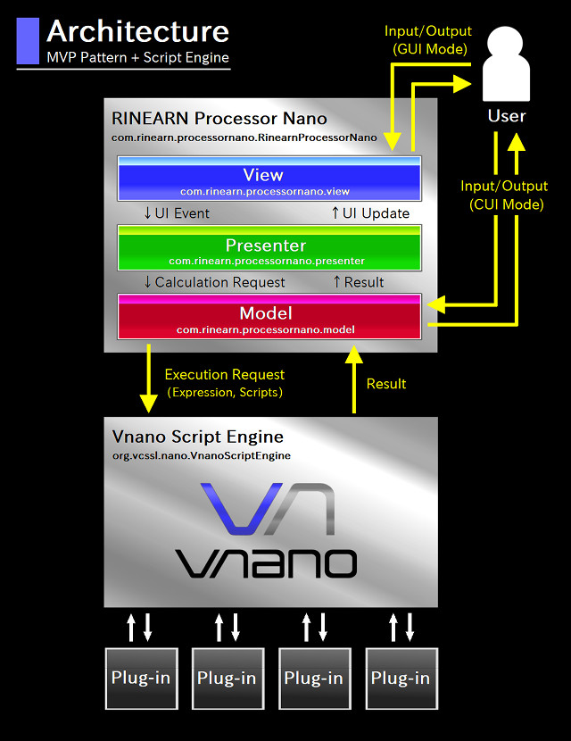

# Software Architecture of the RINPn - RINPn のソフトウェアアーキテクチャ

Here we will explain the internal architecture of this software, which help you to grasp the global structure of the implementation before reading source code.

ここでは、ソースコードを把握する際の参考となる情報として、このソフトウェアの内部的なアーキテクチャの説明を行います。

## Abstract and a Block Diagram - 概要とブロック図

The architecture of the RINPn adopts the MVP pattern which consists mainly of 3 core components: Model, View, and Presenter.
Each component is packed as a package.

RINPn の本体は、
Model / View / Presenter の3つの主要コンポーネントを軸に構成される、MVPパターンに基づくアーキテクチャを採用しています。
各コンポーネントは、それぞれ個別のパッケージとしてまとめられています。

In addition, although it is completely independent from the implementation of the RINPn, the script engine of the Vnano to take calculations is also an important component from the point of view of the architecture of the whole software.

また、RINPn 本体の実装とは完全に独立していますが、計算処理を担う Vnano のスクリプトエンジンも、ソフトウェア全体のアーキテクチャの観点では1つの重要なコンポーネントです。

The following is a block diagram to grasp relationship between components we mentioned above:

下図は、各コンポーネントの関係を把握するためのブロック図です：

As in the above diagram, 
<a href="https://github.com/RINEARN/rinpn/blob/master/src/com/rinearn/processornano/RinearnProcessorNano.java">RinearnProcessorNano</a> 
class plays the role of the outer frame of implementation of this software, 
and in there Model/View/Presenter components are combined and work together.
In the following, we will explain roles of components.

上図の通り、
<a href="https://github.com/RINEARN/rinpn/blob/master/src/com/rinearn/processornano/RinearnProcessorNano.java">RinearnProcessorNano</a> 
クラスがこのソフトウェアの実装の外枠で、その中で Model/View/Presenter の各コンポーネントが組み合わさって動いています。
以下では、各コンポーネントの役割を解説します。

## Model - モデル ( <a href="https://github.com/RINEARN/rinpn/blob/master/src/com/rinearn/processornano/model/">com.rinearn.processornano.model</a> package )

This component provides the functional aspects of the calculator, excepting the UI.
For example, this component takes a calculation expression as an input, and return the calculated result as an output.

このコンポーネントは、UI層を除いた、電卓としての機能面を提供します。
例えば、計算式が入力されると、その計算結果を出力として返します。

In the GUI mode, input/output (I/O) to this component are performed in event-driven ways through the Presenter, so it is a little difficult to grasp the processing flow (see <a href="#architecture-presenter">the explanation of the Presenter</a> for details).
In the contrast, the processing flow in the CUI mode is continuous and synchronized, so it is very easy to grasp: Firstly, 
"calculate" method of 
<a href="https://github.com/RINEARN/rinpn/blob/master/src/com/rinearn/processornano/model/CalculatorModel.java">CalculatorModel</a> 
class will be called from the "calculate" method of 
<a href="https://github.com/RINEARN/rinpn/blob/master/src/com/rinearn/processornano/RinearnProcessorNano.java">RinearnProcessorNano</a> 
class, which will be called from "main" method.
The calculation expression inputted from the command-line will be passed as an argument of the method, so then next, it takes the calculation by calling the script engine (see <a href="#architecture-engine">the explanation of the script engine</a> for details), and output the result to the standard-output.

このコンポーネントの入出力は、GUIモードでは Presenter を介してイベント駆動で行われるため、処理の流れは少し複雑です（詳細は<a href="#architecture-presenter">Presenter の説明</a>参照）。
対して、CUIモードでの処理の流れは、連続的かつ同期的で、非常に単純です： 具体的には、
<a href="https://github.com/RINEARN/rinpn/blob/master/src/com/rinearn/processornano/RinearnProcessorNano.java">RinearnProcessorNano</a> 
クラスの main メソッド から calculate メソッドを介して、
<a href="https://github.com/RINEARN/rinpn/blob/master/src/com/rinearn/processornano/model/CalculatorModel.java">CalculatorModel</a> クラスの calculate メソッドが呼ばれます。
この引数に、コマンドラインから入力された計算式が渡されるので、
それをスクリプトエンジンに渡して計算して（詳細は<a href="#architecture-engine">Script Engine の説明</a>参照）、
結果を標準出力に表示するだけです。

## View - ビュー ( <a href="https://github.com/RINEARN/rinpn/blob/master/src/com/rinearn/processornano/view/">com.rinearn.processornano.view</a> package )

In the GUI mode, this component play the role of the graphical surface of the UI, which composed of a window, text fields, and so on.
Please note that this component does NOT handle any events from the UI by itself (it is a role of the <a href="#architecture-presenter">Presenter</a>).

このコンポーネントは、GUIモードにおいて、ウィンドウやテキストフィールドなどで構成される、UIのグラフィカルな表面（見える部分）の役割を担います。
ただし、このコンポーネント自身は、UIからのイベントを処理しない事に留意が必要です（イベント処理は <a href="#architecture-presenter">Presenter</a> が担います）。

The implementation of the surface of the UI is provided by 
<a href="https://github.com/RINEARN/rinpn/blob/master/src/com/rinearn/processornano/view/ViewImpl.java">ViewImpl</a> class, 
and an instance of this class is accessed through 
<a href="https://github.com/RINEARN/rinpn/blob/master/src/com/rinearn/processornano/view/ViewInterface.java">ViewInterface</a> interface 
from outside of the View component (package).
An instance of ViewImpl class is initialized by 
<a href="https://github.com/RINEARN/rinpn/blob/master/src/com/rinearn/processornano/view/ViewInitializer.java">ViewInitializer</a> class on the event-dispatching thread  (by using the feature of "SwingUtilities.invokeAndWait" method).

UI表面の実装は <a href="https://github.com/RINEARN/rinpn/blob/master/src/com/rinearn/processornano/view/ViewImpl.java">ViewImpl</a> 
クラスによって提供され、このクラスのインスタンスには、View以外のコンポーネント（パッケージ）からは 
<a href="https://github.com/RINEARN/rinpn/blob/master/src/com/rinearn/processornano/view/ViewInterface.java">ViewInterface</a> 
インターフェースを介してアクセスされます。
ViewImpl クラスのインスタンスは、（"SwingUtilities.invokeAndWait" メソッドの機能を介して）イベントディスパッチスレッド上で
<a href="https://github.com/RINEARN/rinpn/blob/master/src/com/rinearn/processornano/view/ViewInitializer.java">ViewInitializer</a> クラスを用いて初期化されます。

## Presenter - プレゼンター ( <a href="https://github.com/RINEARN/rinpn/blob/master/src/com/rinearn/processornano/presenter/">com.rinearn.processornano.presenter</a> package )

This component mediates between the Model and the View.
Classes in this component will behave individually in event-driven ways, after they are linked to the Model and the View by "link" method of 
<a href="https://github.com/RINEARN/rinpn/blob/master/src/com/rinearn/processornano/presenter/Presenter.java">Presenter</a> 
class.

このコンポーネントは、GUIモードにおいて、View と Model の間を仲介します。
このコンポーネント内の各クラスは、
<a href="https://github.com/RINEARN/rinpn/blob/master/src/com/rinearn/processornano/presenter/Presenter.java">Presenter</a> 
クラスの "link" メソッドによって Model と View の間に接続された後は、個々にイベント駆動で動作します。

The action to the UI by the user to perform a calculation will be catched by UI event listeners ( e.g. 
<a href="https://github.com/RINEARN/rinpn/blob/master/src/com/rinearn/processornano/presenter/RunKeyListener.java">RunKeyListener</a> 
class, 
<a href="https://github.com/RINEARN/rinpn/blob/master/src/com/rinearn/processornano/presenter/RunButtonListener.java">RunButtonListener</a> 
class, and so on
) in this component.
Then those listeners create a new thread and an instance of 
<a href="https://github.com/RINEARN/rinpn/blob/master/src/com/rinearn/processornano/model/AsynchronousCalculationRunner.java">AsynchronousCalculationRunner</a> 
class of "model" package, to run calculation asynchronously on the created thread. 
AsynchronousCalculationRunner class executes the calculation by calling "calculate" 
method of 
<a href="https://github.com/RINEARN/rinpn/blob/master/src/com/rinearn/processornano/model/CalculatorModel.java">CalculatorModel</a> 
class, and notify the result to a calculation event listener (defined in RunButton class) which imprementing 
<a href="https://github.com/RINEARN/rinpn/blob/master/src/com/rinearn/processornano/model/AsynchronousCalculationListener.java">AsynchronousCalculationListener</a> 
interface.
Finally, the calculation event listener requests to the event-dispatching thread
to update the UI on by using view updater classes ( e.g. 
<a href="https://github.com/RINEARN/rinpn/blob/master/src/com/rinearn/processornano/presenter/OutputFieldUpdater.java">OutputFieldUpdater</a>, and so on).

ユーザーのUI操作による計算実行アクションには、まずこのコンポーネント内のUIイベントリスナ（
<a href="https://github.com/RINEARN/rinpn/blob/master/src/com/rinearn/processornano/presenter/RunKeyListener.java">RunKeyListener</a> 
クラスや
<a href="https://github.com/RINEARN/rinpn/blob/master/src/com/rinearn/processornano/presenter/RunButtonListener.java">RunButtonListener</a> 
クラスなど ）が反応します。
その処理で新しいスレッドが生成され、その上で非同期に計算を実行するために、model パッケージの 
<a href="https://github.com/RINEARN/rinpn/blob/master/src/com/rinearn/processornano/model/AsynchronousCalculationRunner.java">AsynchronousCalculationRunner</a> 
クラスのインスタンスが生成されます。
AsynchronousCalculationRunner クラスは、
<a href="https://github.com/RINEARN/rinpn/blob/master/src/com/rinearn/processornano/model/CalculatorModel.java">CalculatorModel</a>
クラスの calculate メソッドを呼び出して計算を実行し、その結果を
<a href="https://github.com/RINEARN/rinpn/blob/master/src/com/rinearn/processornano/model/AsynchronousCalculationListener.java">AsynchronousCalculationListener</a> インターフェースを実装した計算イベントリスナ（RunButtonクラス内で定義）に通知します。
すると、その計算イベントリスナが、ビューアップデータ（ 
<a href="https://github.com/RINEARN/rinpn/blob/master/src/com/rinearn/processornano/presenter/OutputFieldUpdater.java">OutputFieldUpdater</a> 
クラスなど 
）を介して、イベントディスパッチスレッド上でUIの表示を更新します。

## Script Engine - スクリプトエンジン ( <a href="https://github.com/RINEARN/vnano/blob/master/src/org/vcssl/nano/">org.vcssl.nano</a> package )

This component takes calculations requested by the Model. 
Executions of scripts, and communications with plug-ins, are also taken by this component.
By the way, this component is being developed independently as the compact script engine "Vnano" for embedded use in applications.
Therefore, for details of this component itself, see the document of: <a href="https://github.com/RINEARN/vnano">https://github.com/RINEARN/vnano</a>

このコンポーネントは、Model から要求された計算を実行する役割を担います。
スクリプトの実行や、プラグインとのやり取りも、このコンポーネントによって行われます。
なお、このコンポーネントは、アプリケーション組み込み用のスクリプトエンジン「 Vnano 」として、このソフトウェアとは独立に開発進行中のものです。
従って、このコンポーネント自身についての詳細は、そちらのドキュメントをご参照ください： 
<a href="https://github.com/RINEARN/vnano">https://github.com/RINEARN/vnano</a>

This component is accessed from the Model through javax.script.ScriptEngine interface of Java&reg; Scripting API.
On the CUI mode, "eval" method of the script engine is simply called in the processing of the "calculate" method of 
<a href="https://github.com/RINEARN/rinpn/blob/master/src/com/rinearn/processornano/model/CalculatorModel.java">CalculatorModel</a> class.
The "eval" method takes a calculation expression (or script) as an argument, and returns the calculated result as a return-value.

このコンポーネントは、Java&reg; Scripting API の javax.script.ScriptEngine インターフェースを介して、Model からアクセスされます。
CUIモードでは、
<a href="https://github.com/RINEARN/rinpn/blob/master/src/com/rinearn/processornano/model/CalculatorModel.java">CalculatorModel</a> 
クラスの calculate メソッド内の処理において、スクリプトエンジンの eval メソッドが単純に呼び出されます。
この eval メソッドは、引数として渡された式（やスクリプト）の値を計算して、その結果を戻り値として返します。

On the GUI mode, when an calculation is requested by the user,
an instance of <a href="https://github.com/RINEARN/rinpn/blob/master/src/com/rinearn/processornano/model/AsynchronousCalculationRunner.java">AsynchronousCalculationRunner</a> class will be created, and "run" method of the class will be invoked on an other thread.
From there, "calculate" method of 
<a href="https://github.com/RINEARN/rinpn/blob/master/src/com/rinearn/processornano/model/CalculatorModel.java">CalculatorModel</a>
class which we mentioned above will be called, and "eval" method of the script engine will be called in there (see also: <a href="#architecture-presenter">the explanation of the Presenter</a>).

GUIモードでは、ユーザーによって計算がリクエストされた際に 
<a href="https://github.com/RINEARN/rinpn/blob/master/src/com/rinearn/processornano/model/AsynchronousCalculationRunner.java">AsynchronousCalculationRunner</a> 
クラスのインスタンスが生成され、その run メソッドが別スレッドで実行されます。
そこから、先ほども述べた <a href="https://github.com/RINEARN/rinpn/blob/master/src/com/rinearn/processornano/model/CalculatorModel.java">CalculatorModel</a> クラスの calculate メソッドが実行され、その中でスクリプトエンジンの eval メソッドが呼び出されます
（<a href="#architecture-presenter">Presenter の説明</a>も参照）。

---

## Credits - 本文中の商標など

- Oracle and Java are registered trademarks of Oracle and/or its affiliates. 

- Other names may be either a registered trademarks or trademarks of their respective owners. 

- OracleとJavaは、Oracle Corporation 及びその子会社、関連会社の米国及びその他の国における登録商標です。文中の社名、商品名等は各社の商標または登録商標である場合があります。

- その他、文中に使用されている商標は、その商標を保持する各社の各国における商標または登録商標です。

